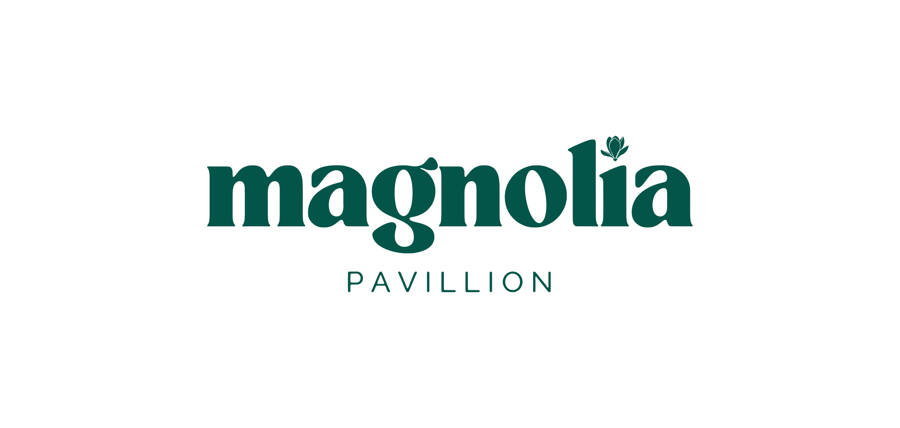

  

  <em>the heritage of Asia and the spirit of America, united by the essence of Magnolia</em>

  <a href="https://kittinatger.github.io/magnolia-hotel-concept/"><strong>View the live site »</strong></a>

---

## About

**Magnolia** is a fictional eco-cultural resort concept set on 18 acres near Fallen Leaf Lake, just outside South Lake Tahoe, California. This repository is the static marketing website built for the concept — a single-page site that combines regional Asian architecture and hospitality with the outdoor lifestyle of the Sierra Nevada.

The project exists to explore hospitality branding, information architecture, and UI design for a resort with four distinct "wings" (South, East, North, West), each inspired by a different region of Asia, surrounding a shared garden atrium.

## Features

- **Four regional buildings** — South, East, North & West wings, each with its own architectural story, clickable for detail
- **Rooms & Residences** — four room tiers (Standard, Luxury Suites, Family Room Suite, Resort Villas & Bungalows) with a demo reservation form
- **The Grounds** — restaurant, spa, art gallery, pool/sauna/onsen, market, and more, each with details in a shared popup
- **Sustainability** — solar power, water conservation, and other eco-commitments
- **Weddings & Private Events**
- **Experiences by Season** — year-round programming across all four seasons
- **Activities** — on the water, on the trails, and winter on the mountain, organized by category
- **Weekend Shows & Gatherings** — a self-updating calendar of recurring weekend programming
- **Membership tiers** — Bud & Bloom
- **Getting Here** — airport shuttle, local transit, and driving directions
- Fully responsive, from mobile through desktop, with a consistent popup/modal system used across every clickable section

## Tech Stack

No build tooling, no framework — just:

- `index.html` — page structure and content
- `style.css` — all styling, including responsive breakpoints
- `script.js` — modal system, dynamic calendar, and demo booking/contact forms

Fonts: [Fraunces](https://fonts.google.com/specimen/Fraunces) (serif) and [Jost](https://fonts.google.com/specimen/Jost) (sans-serif) via Google Fonts.

## Deployment

The site is deployed via GitHub Pages directly from this repository at:
**https://kittinatger.github.io/magnolia-hotel-concept/**

## Disclaimer

Magnolia is a fictional concept created for design and development practice. It is not a real, bookable hotel — all pricing, availability, and reservation forms on the site are non-functional demos.

## Credits

Designed and built by [Kittinat Gerdsri](https://kittinatger.github.io/kittinat-gerdsri/).
